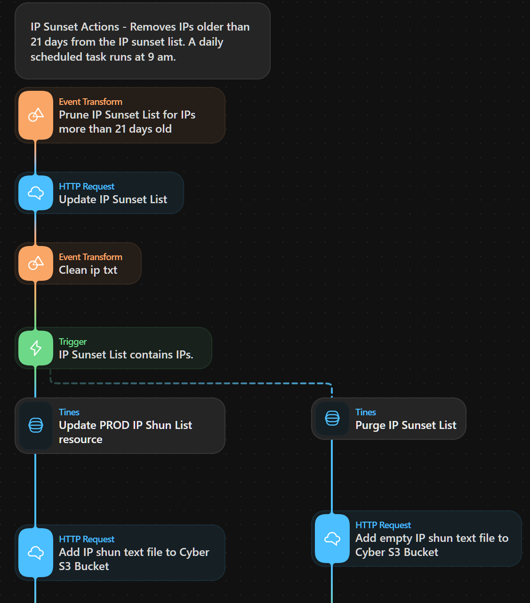
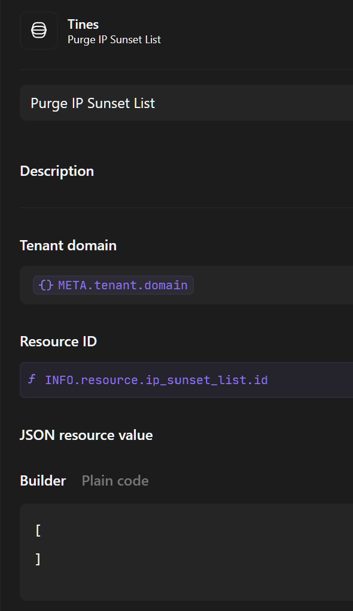

# Working with Tines Resources

As mention in a previous blog, the first automation project we tackled concerned shunning malicious IP addresses on the Cisco Next-Gen Firewall (NGFW) without any involvement from the Network Management team.  In the Firewall Management Center, we used the custom network security intelligence feed as a means to shun IPs at the border.  The NGFW consumes two text files via URLs, one containing the list of IPs to shun, and the other containing the MD5 hash of the IP shun list.  

We decided to host the files on an S3 bucket, since it contains only Indicators of Compromise (IOCs), therefore no PI data. By using AWS, we didn't have to maintain any internal infrastructure.

One challenge, facing the Security Operations Centre (SOC), is how to lifecycle or sunset IOCs, especially IP addresses since threat actors rapidly cycle through them during phishing campaigns.  It is easy to add IOCs to a security platform, but how do we track them and sunset them automatically.

Our Tines Customer Success Engineer recommeneded using Tines Resources.  

A Tines Resource allows the storage of information outside of a workflow, similar to a global variable in software development.  The information, saved to a resource, can be consumed in a Tines Action, downstream in the same workflow or in other workflows.

Here is an example of the Tines Resource, a sunset list used to track IPs:

## Creating the IP shun and MD5 text files

Via a web form submission page, a security analyst submits IPs to be shunned.

Then, a series of actions creates the IP object, appends the IP object to the sunset list, and creates the IP shun list that is posted to the S3 bucket:

The first action creates the IP object by appending the date along with the submitted IP:

 
 The IPs are written to an IP sunset list, along with the submission date. 

 Then, a Tines Append Element to a resource action adds the IP object to the sunset list:

 Below, we have two objects with two key-value pairs: ip and date

 

After adding the IPs to the sunset list, a series of actions create an IP shun list from the sunset list. 

This action formats the IP sunset list, so each IP address is on a single line, and outputs the results in text format:

Then, the next action updates a Tines Resource, called ipshun_txt, with the text output of the previous action:

 By a Tines HTTP Request action, the Tines workflow posts the IP shun list to the S3 bucket. In the below example, we see another use for Tines Resources such as the name of the S3 bucket and the file name of the IP shun list.
 
 
The next action calculates the MD5 hash of the IP shun file, which gets written to another Tines Resource, md5_txt.  

The MD5 hash file is pushed to the S3 bucket, using the Tines HTTP Request action similar to the IP shun action.  Both the IP Shun List and MD5 hash files are consumed by the NGFW custom intelligence feed.
## Sunsetting IP Addresses
For sunsetting IPs, we had another series of actions which filtered out stale IP addresses.

For the IOC decay value, we used 21 days, so any IP address submitted 21 or more days ago is filtered.

Then, the next series of actions create an updated IP shun list and MD5 hash files which are posted to the S3 bucket.   

## What happens when the IP Sunset List is Empty?
If all IPs are removed from the sunset list, the Update IP Sunset List action produces an empty array.  So, I had to build the following trigger:

The next action purges the IP sunset list:

Then, the empty IP Shun list is posted to the S3 bucket along with the MD5 hash file:

I hope you found this useful.

Tines Resources provides flexibility in building out workflows.

Once you start automating, you cannot stop!
Happy Building.

Tom

## Tines Documenation
- [Tines Resources](https://www.tines.com/docs/resources/)
- [Tines Object Function](https://www.tines.com/docs/formulas/functions/object/)
- [Tines MD5 Function](https://www.tines.com/docs/formulas/functions/md5/)
- [Tines Append Function](https://www.tines.com/docs/formulas/functions/append/)
- [Tines Append Element to Resource](https://www.tines.com/api/resources/append-element/)
- [Tines Update a Resource](https://www.tines.com/api/resources/update/)
- [Tines Filter Function](https://www.tines.com/docs/formulas/functions/filter/)
- [Tines Lambda Function](https://www.tines.com/docs/formulas/functions/lambda/)
- [Tines Community Edition](https://www.tines.com/pricing/)

[Previous Blog](https://automatesecops.github.io/Tines-Pagination/)
